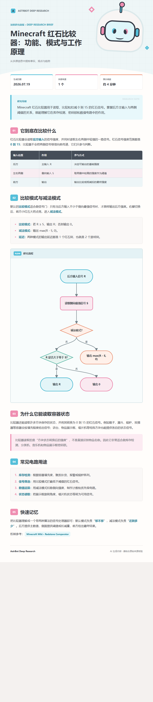
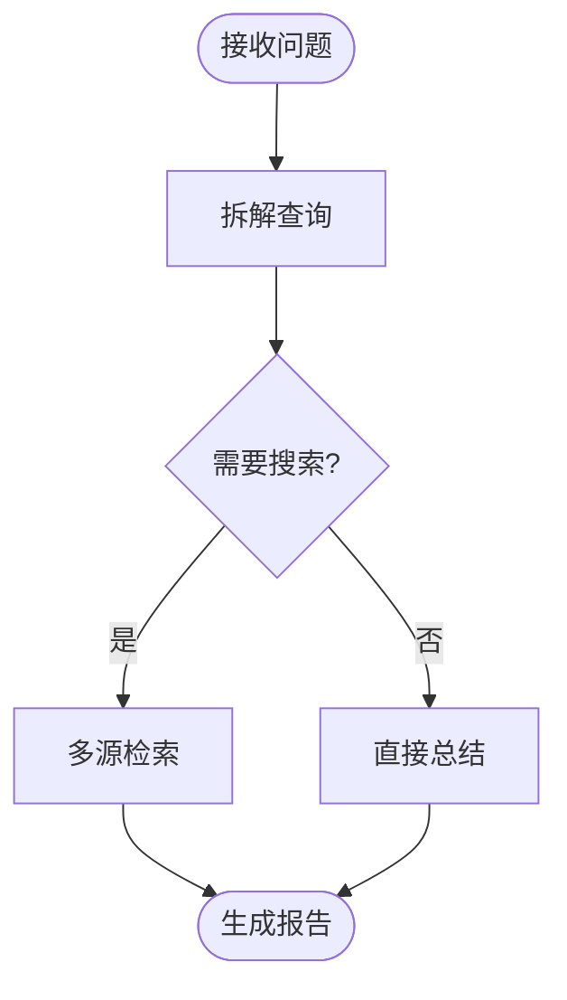
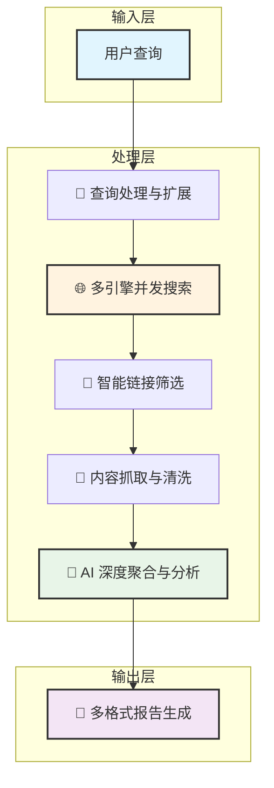

<div align="center">

# 🔬 AstrBot Deep Research Plugin

**一个为 AstrBot 设计的 AI 深度研究插件，利用多引擎并发搜索和 LLM 技术，为您生成全面、深入、多维度的研究报告。**

<p>
  <a href="https://github.com/zhang132212/astrbot-plugin-deepresearch/releases"></a>
  <a href="#"></a>
  <a href="#"></a>
  <a href="./LICENSE"></a>
</p>

<p>
  
  
  
</p>

</div>

---

## 📖 目录 (Table of Contents)

- [✨ 核心特性](#-核心特性)
- [🚀 快速上手](#-快速上手)
- [🐳 Docker 部署 AstrBot](#-docker-部署-astrbot)
- [🖼️ 图片报告与流程图](#️-图片报告与流程图)
- [🗺️ 路线图 (Roadmap)](#️-路线图-roadmap)
- [🏗️ 技术架构](#️-技术架构)
- [🤝 如何贡献](#-如何贡献)
- [📄 开源许可](#-开源许可)
- [🔗 相关链接](#-相关链接)

## ✨ 核心特性

<table>
<tr>
<td width="50%" valign="top">

### 🔍 智能多引擎搜索
- **并发搜索**：同时调用 **8+** 主流搜索引擎，最大化信息覆盖面。
- **广泛覆盖**：无缝整合**中文**及**国际**搜索引擎，打破信息壁垒。
- **毫秒级响应**：优化的异步架构，确保快速返回搜索结果。
- **智能容错**：单个引擎故障不影响整体流程，保证服务稳定性。

</td>
<td width="50%" valign="top">

### 🧠 AI 驱动的深度分析
- **LLM 赋能**：利用大语言模型深刻理解、总结和重构搜索内容。
- **四阶段处理**：通过`查询扩展` -> `链接筛选` -> `内容聚合` -> `报告生成`的标准化流程，确保报告质量。
- **智能筛选**：自动过滤低质量、不相关的链接，提取高价值信息。
- **自动摘要**：从海量文本中生成精炼、准确的摘要和结论。

</td>
</tr>
<tr>
<td width="50%" valign="top">

### 🎨 灵活的多格式输出
- **精美图片**：将报告渲染为适合移动端分享和查看的图片。
- **研究简报主题**：图片报告包含封面、摘要、阅读信息、章节编号、表格、引用与页脚。
- **内嵌流程图**：在主题适合时，将 Mermaid 流程图渲染为离线 SVG 并嵌入图片报告。
- **Markdown 文档**：提供结构化的 `.md` 文件，便于二次编辑和归档。
- **交互式 HTML**：生成独立的网页，提供更丰富的交互体验。
- **移动端优化**：所有输出格式均对移动设备友好。

</td>
<td width="50%" valign="top">

### ⚡ 高性能与高可用架构
- **全异步设计**：基于 `asyncio` 构建，实现高效的 I/O 并发处理。
- **智能重试**：内置网络请求重试机制，从容应对临时性网络问题。
- **速率限制**：智能处理搜索引擎的速率限制，避免被封禁。
- **模块化设计**：代码结构清晰，易于扩展和维护新的搜索引擎或功能。

</td>
</tr>
</table>

## 🚀 快速上手

### 基础用法

通过向 AstrBot 发送指令来触发深度研究：

```sh
# 默认使用 Markdown 格式进行研究
/deepresearch 人工智能的未来发展趋势

# 指定输出为 image 格式
/deepresearch Python编程最佳实践 image

# 指定输出为 html 格式
/deepresearch 区块链技术应用 html
```

### 高级选项

<details>
<summary>🔧 <strong>支持的搜索引擎</strong></summary>

| 搜索引擎 | 类型 | 特色 | 状态 |
| :--- | :--- | :--- | :---: |
| 🔍 百度搜索 | 中文 | 中文内容覆盖最全 | ✅ |
| 🌐 Bing 搜索 | 国际 | 国际化内容丰富，结果质量高 | ✅ |
| 🦆 DuckDuckGo | 隐私 | 注重用户隐私，无追踪 | ✅ |
| 🔍 搜狗搜索 | 中文 | 智能中文检索 | ✅ |
| 🎯 360 搜索 | 中文 | 本土化搜索体验 | ✅ |
| ... | ... | ... | ... |

</details>

<details>
<summary>📊 <strong>支持的输出格式</strong></summary>

| 格式 | 命令 | 适用场景 | 特点 |
| :---: | :---: | :--- | :--- |
| 📝 **Markdown** | (默认) | 文档编辑、二次创作 | 格式通用，便于复制和修改 |
| 🖼️ **Image** | `image` | 移动端分享、快速预览 | 精美排版，一图胜千言 |
| 🌐 **HTML** | `html` | 网页展示、完整报告 | 交互性强，包含所有源链接 |

</details>

## 🐳 Docker 部署 AstrBot

以下示例面向已安装 Docker Compose 的 Linux 服务器或 NAS。AstrBot 官方 Docker 镜像为 `soulter/astrbot`；镜像标签、首次初始化流程与平台接入方式请以 [AstrBot 官方 Docker 文档](https://docs.astrbot.app/deploy/astrbot/docker.html) 为准。

### 1. 启动 AstrBot

在一个专用目录中新建 `compose.yaml`：

```yaml
services:
  astrbot:
    image: soulter/astrbot:latest
    container_name: astrbot
    restart: unless-stopped
    ports:
      - "127.0.0.1:6185:6185"
    volumes:
      - ./data:/AstrBot/data
    shm_size: "1gb"
```

启动并查看日志：

```sh
docker compose up -d
docker compose logs -f astrbot
```

上例将管理端口绑定在本机回环地址，适合配合反向代理使用。仅在可信内网直接访问时，才改为 `6185:6185`；不要把未加保护的管理端口直接暴露到公网。

### 2. 安装本插件

推荐先通过 AstrBot 的插件管理界面安装。若需要使用 Git 目录安装，在宿主机的 AstrBot 数据目录中执行：

```sh
git clone https://github.com/zhang132212/astrbot-plugin-deepresearch.git \
  ./data/plugins/astrbot_plugin_deepresearch

docker compose exec astrbot python -m pip install \
  -r /AstrBot/data/plugins/astrbot_plugin_deepresearch/requirements.txt

docker compose restart astrbot
```

重启后，在 AstrBot 管理界面启用插件、配置可用的 LLM 提供商，并按需填写 Google Custom Search 的密钥。然后可发送：

```text
/deepresearch Minecraft 红石比较器的工作原理 image
```

### 部署注意事项

- **数据持久化**：必须挂载 `./data:/AstrBot/data`。插件配置、聊天平台配置、缓存及安装的插件都应保留在该卷中；升级前备份 `data/`。
- **依赖安装**：每次更新插件的 `requirements.txt` 后，都在 AstrBot 容器内重新执行 `python -m pip install -r ...`，再重启容器。不要在容器镜像临时层中手工复制插件文件。
- **图片渲染**：图片报告依赖 AstrBot 的 HTML 渲染能力。若出现空白图片、浏览器崩溃或渲染超时，先查看 `docker compose logs -f astrbot`，并保持 `shm_size: "1gb"`；内存紧张时可进一步提高该值。
- **网络与搜索**：本插件需要容器能访问 LLM 提供商、搜索引擎和研究页面。服务器受代理、防火墙或 DNS 限制时，先在容器内确认这些目标可达。
- **密钥与权限**：LLM、Google API 和聊天平台密钥只保存在 AstrBot 配置中，不要提交到 Git 仓库或写入镜像。对管理端使用 HTTPS、访问控制和最小化端口暴露。
- **资源与费用**：一个研究请求会触发多引擎搜索与多次 LLM 调用。生产环境应下调 `max_terms_to_search`、`max_search_results_per_term` 与并发量，并为 LLM 服务设置额度告警。
- **版本兼容性**：本插件通过 AstrBot 的 `Star.html_render` 生成图片。升级 AstrBot 前，先在测试实例执行一次 `image` 输出，确认渲染接口仍可用。

## 🖼️ 图片报告与流程图

图片报告使用自包含的 HTML/CSS 主题，不依赖 CDN、在线字体或浏览器脚本。报告会自动提取标题和导读，并为标题层级、表格、引用、列表及代码块应用适合聊天窗口阅读的排版。



### 自定义横幅

默认主题会在四套内置的原创视觉之间随机切换：研究机器人、资料检索、信号分析与研究笔记。若要使用自己的授权插画，在以下目录放入一个或多个 PNG 文件：

```text
assets/heroes/
```

每次生成报告时，插件会从该目录的 PNG 中随机选择一张；只要目录中存在自定义图片，就会优先使用它们。推荐尺寸为 `900 x 760` 像素，主体置于中部或右侧，并避免在图片底边放置重要内容。旧路径 `assets/report_hero.png` 仍然兼容。更多说明见 [assets/heroes/README.md](assets/heroes/README.md)。

### 流程图语法

当研究主题包含步骤、判断分支、因果链或系统流程时，插件会请求 LLM 在 Markdown 中输出一个 Mermaid 代码块，并把它转换为安全的内嵌 SVG。支持的语法为：



- 支持 `flowchart TD`、`flowchart LR`、普通节点 `A[文本]`、圆角节点 `A([文本])`、判断节点 `A{文本}`、箭头和箭头标签。
- 超过四层的横向流程会自动转为纵向排版，以保证手机图片中的文字可读。
- `subgraph`、`classDef`、`style`、HTML 标签、点击事件和其他 Mermaid 图表类型不会被执行；无法解析时会保留原始代码块。

### 本地预览与验证

```sh
# 生成通用主题预览
python tools/preview_theme.py

# 生成 Minecraft 红石比较器示例
python tools/render_comparator_preview.py

# 运行流程图解析与渲染测试
python -m unittest tests/test_flowchart.py -v
```

预览文件会写入 `preview/` 目录。流程图实现位于 [output_format/flowchart.py](output_format/flowchart.py)。

## 🗺️ 路线图 (Roadmap)

我们正在积极开发中，欢迎您参与进来！

#### ✅ 已完成

- [x] 核心搜索与内容抓取框架
- [x] 集成多个主流搜索引擎
- [x] 集成大语言模型（LLM）进行内容分析与聚合
- [x] 实现 Markdown, Image, HTML 多格式报告输出
- [x] 基础的异步与并发性能优化
- [x] 适合移动端阅读的主题化图片报告
- [x] Mermaid 子集流程图的离线 SVG 渲染

#### 🎯 近期规划

- [ ] **增强结果准确性**：引入更先进的链接质量评估模型。
- [ ] **引入缓存机制**：为相同查询提供缓存，减少重复请求和LLM开销。
- [ ] **自定义搜索引擎**：允许用户在配置文件中启用/禁用特定的搜索引擎。
- [ ] **完善单元测试**：扩展搜索、网页抓取与完整报告管线的测试覆盖率。
- [ ] **优化文档**：提供更详细的配置和二次开发指南。

## 🏗️ 技术架构

本插件采用分层处理架构，确保流程清晰可控。

<details>
<summary><strong>👉 点击查看技术架构图</strong></summary>

<div align="center">



</div>
</details>

## 🤝 如何贡献

我们热烈欢迎各种形式的贡献，无论是报告问题、提交新功能还是改进文档！

1.  **Fork** 本仓库
2.  创建您的特性分支 (`git checkout -b feature/AmazingFeature`)
3.  提交您的更改 (`git commit -m 'Add some AmazingFeature'`)
4.  推送到分支 (`git push origin feature/AmazingFeature`)
5.  创建一个 **Pull Request**

<div align="center">
<br>
<a href="https://github.com/zhang132212/astrbot-plugin-deepresearch/issues"></a>
&nbsp;
<a href="https://github.com/zhang132212/astrbot-plugin-deepresearch/pulls"></a>
<br><br>
</div>

## 📄 开源许可

本项目基于 [AGPL-3.0](LICENSE) 协议开源。请确保在使用前了解其条款。

原项目由 [lxfight/astrbot_plugin_deepresearch](https://github.com/lxfight/astrbot_plugin_deepresearch) 开发；本仓库保留原作者署名，并在此基础上维护报告主题与流程图渲染功能。

## 🔗 相关链接

- 🏠 **AstrBot 主项目**: [github.com/AstrBotDevs/AstrBot](https://github.com/AstrBotDevs/AstrBot)

---
11
<div align="center">

### 🌟 如果这个项目对您有帮助，请考虑给一个 Star ⭐
  

### 如果这个项目对您有帮助，请给一个 Star ⭐ 支持我们！

<a href="https://github.com/zhang132212/astrbot-plugin-deepresearch/stargazers">
  
</a>

<br>

<sub>最后更新：2025-06-18</sub>

</div>
